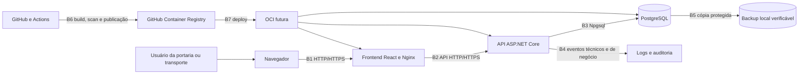

# Modelagem de ameaças

## Identificação

**Sistema:** Controle de Acesso de Veículos do IFPE — Campus Belo Jardim

**Método:** diagrama de fluxo de dados e classificação STRIDE

**Versão:** 3.5

**Data de referência:** 29 de setembro de 2026

**Rastreabilidade:** Issues #26, #67, #69, #71, #73, #76, #78, #90, #102, #104, #106, #190, #191, #196, #210, #213, #218, #220, #227, #251 e #258

## Objetivo e limites

Esta modelagem identifica riscos de segurança e privacidade no desenho atual e
planejado do sistema. Ela cobre frontend, API, PostgreSQL, containers, GitHub,
CI/CD, operação local, implantação futura e backups.

Não são considerados implementados:

- matriz definitiva de autorização;
- auditoria transversal e imutável;
- demais endpoints funcionais além dos fluxos geral, correção descritiva, institucional, consultas históricas e catálogos de frota e motoristas;
- ambiente de homologação ou produção;
- OCI, domínio, HTTPS e proxy reverso;
- backup protegido de produção, política de recuperação e contingência;
- collector, armazenamento, painéis, alertas e resposta operacional de observabilidade.

O documento deve ser atualizado quando esses componentes forem projetados ou
implementados.

## Metodologia

STRIDE organiza ameaças em falsificação de identidade, adulteração, repúdio,
divulgação de informação, negação de serviço e elevação de privilégio. O processo
adotado é: desenhar o fluxo, identificar fronteiras de confiança, enumerar riscos,
definir mitigações e validar sua implementação.

Essa abordagem segue o processo do
[Microsoft Threat Modeling Tool](https://learn.microsoft.com/en-us/azure/security/develop/threat-modeling-tool-getting-started).
Os controles são complementados pelo
[OWASP ASVS](https://owasp.org/www-project-application-security-verification-standard/)
e pelo
[NIST SSDF SP 800-218](https://csrc.nist.gov/pubs/sp/800/218/final).

## Modelo visual no OWASP Threat Dragon

O arquivo
[`controle-acesso-veiculos-threat-model.json`](controle-acesso-veiculos-threat-model.json)
é a representação visual versionada deste documento para OWASP Threat Dragon
2.x. Ele contém o fluxo principal, a cadeia de entrega, as fronteiras de
confiança e as ameaças `TM-01` a `TM-23` associadas aos elementos relevantes.

O JSON não substitui esta fonte textual: probabilidades, impactos, riscos
residuais e decisões institucionais continuam detalhados aqui. Mudanças de
arquitetura devem atualizar os dois artefatos na mesma revisão.

## Escala de risco

| Valor | Probabilidade                      | Impacto                                                                |
| ----: | ---------------------------------- | ---------------------------------------------------------------------- |
|     1 | Improvável no desenho atual        | Efeito localizado e recuperável                                        |
|     2 | Possível ou dependente de condição | Interrupção ou exposição limitada                                      |
|     3 | Provável sem controle              | Exposição pessoal, perda de integridade ou indisponibilidade relevante |

O nível é `probabilidade × impacto`:

- 1–2: baixo;
- 3–4: médio;
- 6–9: alto.

A classificação orienta prioridade, mas não substitui decisão institucional.

## Ativos

| Ativo                                                             | Necessidade de proteção                     |
| ----------------------------------------------------------------- | ------------------------------------------- |
| Dados de pessoas e documentos opcionais                           | Confidencialidade, finalidade e minimização |
| Placas, vínculos e histórico de acesso                            | Confidencialidade e integridade             |
| Itinerários e quilometragens                                      | Integridade e acesso restrito               |
| Eventos, responsáveis, áreas, períodos e autorizações de veículos | Confidencialidade, integridade e finalidade |
| Credenciais, sessões e hashes                                     | Confidencialidade e resistência a fraude    |
| Perfis e permissões                                               | Integridade e menor privilégio              |
| Auditoria                                                         | Integridade, disponibilidade e não repúdio  |
| Banco e migrations                                                | Integridade, disponibilidade e recuperação  |
| Código, workflows e dependências                                  | Integridade da cadeia de suprimentos        |
| Configurações e segredos                                          | Confidencialidade e rotação                 |
| Continuidade da portaria                                          | Disponibilidade e reconciliação confiável   |

## Atores

- porteiro e vigilante;
- Setor de Transporte;
- administrador autorizado;
- equipe de desenvolvimento e operação;
- GitHub Actions e serviços de dependências;
- pessoa externa sem autenticação;
- usuário autenticado mal-intencionado;
- atacante com acesso à rede, dispositivo ou credencial;
- fornecedor ou dependência comprometida.

## Fluxo de dados

## Fronteiras de confiança

| Fronteira | Mudança de confiança                      | Estado                                                                                                                                                                                                                                        |
| --------- | ----------------------------------------- | --------------------------------------------------------------------------------------------------------------------------------------------------------------------------------------------------------------------------------------------- |
| B1        | Dispositivo/rede do usuário para frontend | Proxy local com política de conteúdo e cabeçalhos defensivos; domínio, HTTPS e HSTS de produção pendentes                                                                                                                                     |
| B2        | Código executado no navegador para API    | Sessão renovável integrada: access token somente em memória, refresh token opaco em cookie `HttpOnly`, rotação, revogação, CSRF, repetição limitada e coordenação entre abas; HTTPS de produção pendente                                      |
| B3        | API para PostgreSQL                       | Implementado localmente                                                                                                                                                                                                                       |
| B4        | Aplicação para logs e auditoria           | Logging HTTP estruturado e correlacionado; auditoria transacional implementada na autenticação, ciclo de contas, fluxos geral, correção descritiva, institucional e catálogos, incluindo eventos; consulta da trilha restrita a Administrador |
| B5        | Banco para backup                         | Dump e restauração isolada implementados localmente; configuração reproduzível do Object Storage privado, Vault, instance principal, IAM, retenção e alerta preparada, mas ainda não aplicada nem exercitada na OCI — #311                    |
| B6        | Repositório para runner e registry        | CI valida Pull Requests e `main` sem publicação; uma tag de release revisada reconstrói, analisa e publica imagens no GHCR e registra proveniência e SBOM por digest no GitHub Artifact Attestations com permissão mínima                     |
| B7        | Registry para infraestrutura OCI          | Não implementado                                                                                                                                                                                                                              |
| B8        | API para collector OTLP                   | Exportação opt-in implementada; endpoint e infraestrutura externa pendentes                                                                                                                                                                   |

Todo dado vindo do navegador atravessa uma fronteira não confiável. Validação no
frontend melhora usabilidade, mas não é controle de segurança suficiente.

## Ameaças e mitigações

| ID    | STRIDE                             | Cenário                                                                                                            |   P |   I | Nível | Mitigação e rastreabilidade                                                                                                                                                                                                                                                                                             | Estado                                                                                                                                                                                                                            |
| ----- | ---------------------------------- | ------------------------------------------------------------------------------------------------------------------ | --: | --: | ----: | ----------------------------------------------------------------------------------------------------------------------------------------------------------------------------------------------------------------------------------------------------------------------------------------------------------------------- | --------------------------------------------------------------------------------------------------------------------------------------------------------------------------------------------------------------------------------- |
| TM-01 | Spoofing                           | Conta compartilhada, credencial inicial conhecida por terceiro ou credencial roubada impede identificar o operador |   3 |   3 |     9 | Contas individuais, hash de senha, login uniforme, bloqueio, troca autenticada, versão de credencial, credencial temporária de uso único e expiração curta, troca obrigatória, revogação transacional, auditoria mínima, dois Administradores funcionais e entrega direta ao titular — #29, #71, #73, #220, #251 e #258 | Mitigado no recorte do MVP; o procedimento de entrega direta e o prazo da credencial ainda devem ser observados na homologação da #162, e HTTPS permanece dependência da implantação institucional                                |
| TM-02 | Spoofing                           | Usuário acessa frontend ou API falsos em rede não confiável                                                        |   2 |   3 |     6 | Domínio controlado, HTTPS, certificados e orientação operacional — #25 e implantação futura                                                                                                                                                                                                                             | Planejado                                                                                                                                                                                                                         |
| TM-03 | Tampering                          | Cliente altera IDs, status, horários, quilometragem, evento ou identificação de frota enviados à API               |   3 |   3 |     9 | Políticas por recurso, DTOs, validação, normalização, horário do servidor, FK e unicidade/transação — #29, #31, #47, #53, #55, #61, #65, #82, #271 e #274                                                                                                                                                               | Associação de evento validada e imutável após a entrada; encerramento excepcional separa saída observada de regularização e não aceita horário futuro; correção supervisionada limitada a campos descritivos                      |
| TM-04 | Tampering                          | Acesso direto ao banco altera ou remove histórico                                                                  |   2 |   3 |     6 | Rede restrita, menor privilégio, auditoria, backup e separação de usuários — #30 e #67                                                                                                                                                                                                                                  | Ensaio local de recuperação implementado; controles de produção pendentes                                                                                                                                                         |
| TM-05 | Tampering                          | Workflow, dependency ou imagem comprometida altera o artefato entregue                                             |   2 |   3 |     6 | Branch protegida, Dependabot, lockfiles, actions fixadas, build e scan por arquitetura antes do push, bloqueio de todo achado crítico, tags por commit, manifesto multi-plataforma validado, proveniência assinada e SBOM SPDX por arquitetura — #25, #90, #104, #106 e #218                                            | Parcial; artefatos AMD64/ARM64 verificáveis implementados, mas a política de admissão depende do ambiente de destino                                                                                                              |
| TM-06 | Repudiation                        | Operador nega inclusão, correção ou encerramento de registro                                                       |   3 |   3 |     9 | Usuário autenticado, ator persistido, justificativa, correlation ID e auditoria imutável suficiente — #29, #31, #47, #51, #53, #55, #57, #61, #65, #271 e #274                                                                                                                                                          | Correção descritiva e encerramento excepcional auditados; imutabilidade por privilégios de banco permanece pendente                                                                                                               |
| TM-07 | Information disclosure             | Stack trace, log, erro ou telemetria expõe documento, token ou configuração                                        |   2 |   3 |     6 | Erros seguros, logs mínimos, OTLP limitado a métricas/traces e testes de não exposição — #31, #49 e #102                                                                                                                                                                                                                | Parcialmente mitigado; collector, retenção e revisão de atributos pendentes                                                                                                                                                       |
| TM-08 | Information disclosure             | Consulta ou exportação expõe histórico além da necessidade                                                         |   2 |   3 |     6 | Menor privilégio, filtros por finalidade e auditoria de consulta/exportação — #29, #31, #59, #63, #78, #80 e #274                                                                                                                                                                                                       | Histórico geral restrito aos quatro perfis; Transporte recebe correção descritiva supervisionada, mas não operação; trilha de auditoria restrita a Administrador; auditar consultas e exportações permanece pendente de validação |
| TM-09 | Information disclosure             | Segredo entra no Git, imagem, artefato ou Wiki                                                                     |   2 |   3 |     6 | `.gitignore`, exemplos fictícios, secret scanning e rotação — #25                                                                                                                                                                                                                                                       | Parcial                                                                                                                                                                                                                           |
| TM-10 | Information disclosure             | PostgreSQL publicado em interface de rede inadequada                                                               |   2 |   3 |     6 | Não publicar banco em produção, firewall e rede privada — #25 e implantação futura                                                                                                                                                                                                                                      | Pendente                                                                                                                                                                                                                          |
| TM-11 | Denial of service                  | Payload ou consulta cara esgota API ou banco                                                                       |   2 |   2 |     4 | Limite de payload, paginação, timeout, rate limiting, índices e métricas medidos — #31, #49, #59, #63, #69, #78 e #102                                                                                                                                                                                                  | Limite global de 1 MiB, consultas paginadas, auditoria limitada a 90 dias, rate limiting e métricas exportáveis implementados; calibração com carga, limite distribuído e timeout permanecem pendentes                            |
| TM-12 | Denial of service                  | Falha de rede, API ou PostgreSQL interrompe a portaria                                                             |   3 |   3 |     9 | Readiness, smoke test integrado, telemetria OTLP, monitoramento, backup e contingência reconciliável — #25, #30, #92 e #102                                                                                                                                                                                             | Inicialização integrada verificada e sinais exportáveis configurados; collector, alertas, reconciliação e validação institucional estão pendentes                                                                                 |
| TM-13 | Elevation of privilege             | Usuário comum executa operação administrativa, corrige registro ou acessa histórico indevido                       |   3 |   3 |     9 | Políticas explícitas, deny-by-default, ciclo de contas, correção, consultas históricas, auditoria e leitura/gestão de catálogos separadas e testes por perfil — #29, #55, #57, #59, #63, #65, #73, #78 e #83                                                                                                            | Catálogo de eventos separa leitura operacional de gestão por Transporte/Administração; matriz final pendente                                                                                                                      |
| TM-14 | Elevation of privilege             | Container executado como root amplia impacto de exploração                                                         |   2 |   3 |     6 | Usuário não privilegiado, filesystem e capabilities restritos — #25                                                                                                                                                                                                                                                     | Planejado                                                                                                                                                                                                                         |
| TM-15 | Information disclosure             | Backup desprotegido expõe dados e histórico                                                                        |   2 |   3 |     6 | Manifesto SHA-256 local; configuração reproduzível para OCI Object Storage privado, Vault, instance principal, MFA, separação IAM, retenção e alerta — #30, #67, #308 e #311                                                                                                                                        | Integridade acidental e restauração mitigadas localmente; aplicação na tenancy, exercício e comprovação da proteção em produção permanecem pendentes                                                                              |
| TM-16 | Information disclosure             | Retenção indefinida mantém dados pessoais sem finalidade                                                           |   2 |   3 |     6 | Cinco anos para registros operacionais e papel, 90 dias para logs e 35 dias para backups; descarte rastreável — #30                                                                                                                                                                                                     | Prazo operacional aprovado; revisão arquivística e implementação do expurgo seguro pendentes                                                                                                                                      |
| TM-17 | Tampering                          | Migration causa perda ou transformação sem semântica confiável                                                     |   2 |   3 |     6 | Revisão, backup com restauração verificada, upgrade/downgrade e falha explícita — #23, #30 e #67                                                                                                                                                                                                                        | Backup/restauração local e testes de migration implementados; processo de produção pendente                                                                                                                                       |
| TM-18 | Repudiation                        | Falha na auditoria permite operação sem trilha                                                                     |   2 |   3 |     6 | Atomicidade, falha fechada, ator humano ou origem de sistema explícita, alerta e monitoramento — #31, #51, #53, #55, #57, #65, #71, #73 e #76                                                                                                                                                                           | Mitigado nos fluxos geral, correção descritiva, institucional, catálogos, autenticação e ciclo de contas; alerta e demais operações pendentes                                                                                     |
| TM-19 | Information disclosure             | Collector falso ou mal configurado recebe telemetria operacional                                                   |   2 |   3 |     6 | OTLP desabilitado por padrão, endpoint externo ao código, TLS, autenticação, menor privilégio e revisão de atributos — #102                                                                                                                                                                                             | Base técnica implementada; identidade do collector, secret manager e rede de produção pendentes                                                                                                                                   |
| TM-20 | Spoofing                           | Refresh token roubado, repetido ou usado depois do logout mantém acesso prolongado                                 |   3 |   3 |     9 | Token opaco de 256 bits em cookie `HttpOnly`, hash no banco, rotação atômica, detecção de reutilização, duração absoluta, inatividade e revogação da família — #190 e #191                                                                                                                                              | Mitigado tecnicamente no servidor e cliente; HTTPS e validação no ambiente institucional pendentes                                                                                                                                |
| TM-21 | Spoofing / Tampering               | Site externo induz o navegador autenticado a renovar ou encerrar uma sessão por CSRF                               |   2 |   3 |     6 | `SameSite=Strict`, caminho mínimo, token antifalsificação vinculado ao cookie e arquitetura same-origin — #190 e #191                                                                                                                                                                                                   | Mitigado e testado no fluxo integrado; validação em ambiente HTTPS pendente                                                                                                                                                       |
| TM-22 | Tampering / Information disclosure | Conteúdo não autorizado é carregado ou a aplicação é incorporada por uma página externa                            |   2 |   3 |     6 | CSP same-origin, bloqueio de frames, MIME sniffing desabilitado, política de referência, permissões mínimas e baseline DAST passiva — #196 e #227                                                                                                                                                                       | Mitigado no proxy local e verificado dinamicamente na superfície pública; HTTPS, HSTS, fluxos autenticados e validação no ambiente de destino pendentes                                                                           |
| TM-23 | Tampering / Information disclosure | Consulta de recorrentes enumera pessoas ou cliente adultera os identificadores e textos do vínculo selecionado     |   2 |   3 |     6 | Política operacional, termo entre 3 e 80 caracteres, limite fixo de 10 resultados, rate limiting global por usuário, resposta sem documento/e-mail/histórico e revalidação canônica do par no servidor — #213                                                                                                           | Mitigado no backend; calibração com uso real e integração do frontend permanecem pendentes                                                                                                                                        |
| TM-24 | Spoofing / Information disclosure  | Tablet compartilhado permanece autenticado sem operador e permite uso da sessão por outra pessoa                   |   3 |   3 |     9 | Inatividade de 15 minutos, duração absoluta de 12 horas, referência e prazos emitidos pelo servidor, logout explícito, coordenação entre abas e renovação condicionada a atividade humana — #268                                                                                                                        | Política e contrato do servidor implementados; integração do frontend e validação no tablet da portaria pendentes                                                                                                                 |
| TM-25 | Tampering / Denial of service       | Perda, divergência ou exposição do key ring invalida tokens antifalsificação ou expõe material protegido            |   2 |   3 |     6 | Key ring durável compartilhado, `ApplicationName` estável, XML protegido por certificado X.509 externo, falha fechada de configuração e ensaio de substituição — #355                                                                                   | Mitigado no Compose e na API; provisionamento definitivo em OCI Vault/File Storage e exercício operacional permanecem pendentes                                                                                                   |

## Controles existentes verificados

- separação entre Domain, Application, Infrastructure e API;
- EF Core restrito à Infrastructure/API;
- migrations versionadas e sem execução automática no startup;
- autenticação JWT com validade curta, chave externa e validação de emissor e audiência;
- token de renovação opaco gerado por CSPRNG, armazenado somente como hash e
  entregue em cookie `HttpOnly`, `Secure` em produção e `SameSite=Strict`;
- rotação transacional de refresh token com bloqueio no PostgreSQL, detecção de
  reutilização e revogação de família no replay, logout e desativação da conta;
- timeout de inatividade e duração absoluta impostos pelo servidor, com valores
  configuráveis, prazos explícitos na resposta e proteção CSRF nos endpoints
  baseados em cookie; a detecção de inatividade humana no cliente pertence à
  Issue #268;
- key ring do ASP.NET Core persistido em volume compartilhado e criptografado por
  certificado externo, com configuração obrigatória em containers e produção;
- frontend valida as respostas de login e renovação, mantém o JWT somente em
  memória, restaura e renova a sessão pelo cookie protegido, limita a uma
  repetição por requisição e coordena renovação e encerramento entre abas sem
  compartilhar tokens;
- rotas do frontend exigem sessão e apresentam acesso negado para perfil
  incompatível, sem substituir a autorização do backend;
- hash de senha com salt e derivação, bloqueio temporário e resposta uniforme de login;
- troca autenticada exige a senha atual, incrementa uma versão verificada em cada
  JWT, revoga sessões e audita a operação na mesma transação, sem copiar credenciais;
- login bem-sucedido e bloqueio temporário auditados atomicamente sem credenciais, token, e-mail ou IP, com emissão de token impedida quando a auditoria falha;
- consulta de contas paginada e restrita a Administrador, sem exposição de hash;
- desativação e reativação auditadas atomicamente, com auto-desativação proibida e serialização das mudanças para preservar ao menos um Administrador ativo;
- conta ou perfil inativo rejeitado na validação de toda requisição com JWT, inclusive para token emitido anteriormente;
- criação administrativa e bootstrap auditados atomicamente, distinguindo ator autenticado de origem de sistema sem duplicar dados da conta;
- consulta da trilha restrita a Administrador por política dedicada, com filtros, paginação, janela máxima e distinção entre ator humano e sistema;
- autorização deny-by-default e políticas preliminares testadas;
- políticas distintas para consultar e gerenciar a frota institucional;
- políticas distintas para consultar e gerenciar autorizações de eventos, com
  manutenção restrita ao Administrador e leitura preservada aos quatro perfis;
- políticas distintas para o histórico geral e o histórico institucional;
- política de correção separada da operação e da consulta, concedida a Porteiro,
  Vigilante, Setor de Transporte e Administrador, com justificativa e auditoria;
- política de encerramento excepcional separada, limitada a Porteiro, Vigilante e Administrador, sem ampliar a supervisão somente leitura do Setor de Transporte;
- contratos operacionais e catálogo inicial protegidos, com validação no servidor e erros previsíveis;
- consulta de veículo e condutor recorrentes restrita à política operacional, limitada e
  sem documento, e-mail ou histórico; a entrada revalida o vínculo e usa os dados
  canônicos do servidor em vez de confiar nos textos ou identificadores do navegador;
- entrada e saída regular definidas pelo servidor; no encerramento excepcional, o
  horário observado é opcional, validado e separado do momento de regularização
  definido pelo servidor, sempre vinculado ao usuário autenticado;
- transação e índice único parcial impedem dois acessos abertos para o mesmo veículo;
- bloqueio transacional do evento impede consumo concorrente acima da cota e preserva a associação por FK;
- transação e índice único parcial impedem dois usos institucionais abertos para o mesmo veículo;
- correlation ID validado ou gerado pelo servidor em todas as respostas;
- logs HTTP estruturados com método projetado por lista permitida e template de
  rota, sem valores livres da URL, query string, corpo ou cabeçalho de autorização;
- métricas HTTP/runtime e traces ASP.NET Core exportáveis por OTLP somente quando habilitados, sem instrumentação de corpo, credenciais, SQL ou logs, com valores de query obrigatoriamente redigidos e health checks excluídos dos traces;
- exceções inesperadas retornam `ProblemDetails` sem mensagem interna ou stack trace;
- limite global de 1 MiB para corpos de requisição;
- rate limiting em memória, sem fila, particionado por usuário autenticado ou endereço da conexão, com política específica para login e health checks isentos;
- consultas históricas com período máximo de 366 dias, paginação limitada e índices orientados aos filtros temporais;
- auditoria dos fluxos geral, institucional e catálogos de frota, motoristas e eventos atômica, associada ao operador e sem duplicação de dados pessoais, placa, identificação patrimonial ou itinerário;
- correção descritiva exige justificativa e audita apenas os nomes dos campos alterados, sem copiar objetivo ou observação;
- encerramento excepcional exige motivo e observação, preserva horário de saída desconhecido, registra a regularização separadamente e audita sem copiar o texto livre;
- placa e identificação institucional normalizadas, com unicidade garantida no PostgreSQL;
- migration de alinhamento falha em vez de inventar dados legados;
- documento pessoal opcional e dados de teste fictícios;
- `.env` ignorado e exemplos sem segredo real;
- backup lógico local em formato custom, fora do Git, acompanhado por manifesto
  SHA-256 e validado por restauração completa em banco temporário isolado; o
  checksum não substitui autenticidade nem proteção do armazenamento;
- branch protegida, Pull Requests e CI;
- variantes `linux/amd64` e `linux/arm64` de backend e frontend reconstruídas e analisadas antes da publicação no GHCR por uma tag de release revisada, com bloqueio de todo achado crítico, tag por commit e arquitetura, credencial efêmera de privilégio mínimo e manifesto validado;
- proveniência assinada associada ao digest do manifesto multi-plataforma e SBOM SPDX 2.3 gerado pelo Trivy, validado por arquitetura e registrado no GitHub Artifact Attestations para o mesmo nome e digest publicado, sem cópia OCI no GHCR;
- stack de PostgreSQL, API e frontend iniciada com credenciais, portas e volume descartáveis na CI, com readiness obrigatório antes da publicação;
- baseline DAST passiva com OWASP ZAP executada somente contra a stack descartável, com imagem fixada por digest, política explícita de alertas e relatórios preservados;
- testes unitários e integração PostgreSQL no PR #28;
- auditoria de vulnerabilidades NuGet executada na #23 e #24.

## Risco residual atual

O risco residual permanece alto para a continuidade de produção porque o desenho
aprovado ainda não foi provisionado nem exercitado na OCI. A base OTLP não
substitui collector protegido, painéis, alertas ou resposta operacional. O ensaio
local reduz o risco de um dump inválido, mas não comprova Object Storage, Vault,
PITR, RPO de uma hora, RTO de quatro horas ou contingência institucional. Portanto,
a API atual não deve ser tratada como pronta para exposição pública ou produção.

## Responsabilidades

| Área                        | Responsabilidade                                                       |
| --------------------------- | ---------------------------------------------------------------------- |
| Backend/DB                  | validação, autenticação, autorização, persistência e auditoria         |
| Infra/DevOps                | secrets, rede, containers, CI/CD, backup e observabilidade             |
| Frontend                    | não armazenar segredos; reduzir exposição; tratar sessão com segurança |
| QA                          | testes negativos, autorização, migrations, recuperação e regressão     |
| Responsáveis institucionais | finalidade, perfis, retenção e contingência                            |
| Eurico / Transporte         | fluxo operacional, exceções e fechamento de incidentes                 |
| Orientadores do curso       | acessos privilegiados, custódia IAM e acompanhamento dos exercícios    |
| Equipe técnica do curso     | implantação, monitoramento, backup e runbooks aprovados                |
| Equipe                      | revisão do modelo a cada mudança arquitetural relevante                |

## Gatilhos de revisão

Revisar esta modelagem quando ocorrer:

- novo ator, perfil ou endpoint;
- definição da autenticação;
- mudança no modelo de dados pessoais;
- exportação ou relatório;
- integração externa;
- implantação em homologação/produção;
- mudança de rede, container, CI/CD ou backup;
- incidente ou vulnerabilidade relevante.

## Pendências de validação

- matriz final de permissões;
- necessidade e finalidade de documento pessoal;
- revisão arquivística da retenção e implementação do descarte seguro;
- infraestrutura real da portaria;
- comprovação do RPO de uma hora e RTO de quatro horas;
- substituto do responsável pelo processo e referência de proteção de dados;
- provisionamento e exercício da topologia aprovada na OCI.
